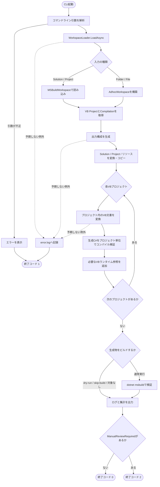
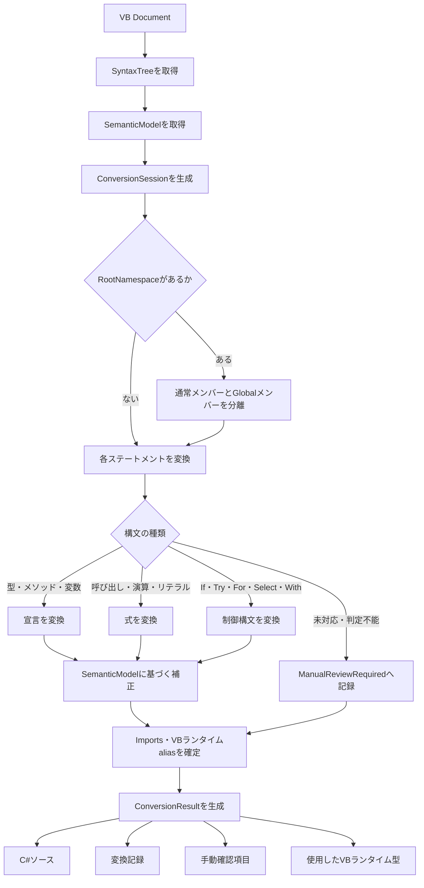

# 処理フロー

この文書は、`VbToCSharpFixer`が入力を読み込み、VBソースとプロジェクト構成をC#へ変換し、結果を検証するまでの大まかな流れを示します。

## CLI全体の流れ

中心となる呼び出し順は、`Program.Main` → `ConversionRunner.RunAsync` → `WorkspaceLoader.LoadAsync` → `LegacyProjectMaterializer.MaterializeAsync` → `ProjectSourceConverter.ConvertAsync`です。

## 1つのVB文書を変換する流れ

`ConversionSession`は構文の文字列だけではなく、Roslynの`SemanticModel`で解決したシンボルと型を使います。これにより、同じ丸括弧を使うメソッド呼び出し・配列アクセス・Indexerや、同名の型・メンバーを区別します。安全に判断できない場合は推測で変換せず、`ManualReviewRequired`として記録します。

## 主なクラスの役割

| クラス | 主な役割 |
|---|---|
| `Program` | 引数解析、終了コード、最上位の例外処理 |
| `ConversionRunner` | 読み込みからログ出力までの実行順序を管理 |
| `WorkspaceLoader` | Solution、Project、Folder、FileをRoslynのCompilationへ読み込み |
| `LegacyProjectMaterializer` | 変換後のSolution／Project構成と出力先を生成 |
| `ProjectConverter` | `.vbproj`の項目、参照、リソース、関連ファイルを変換 |
| `ProjectSourceConverter` | プロジェクト内の各VB文書を変換し、生成C#をまとめて検証 |
| `VbToCSharpConverter` | 1ファイル単位の変換窓口 |
| `ConversionSession` | 宣言、式、制御構文を意味情報に基づいてC#へ変換 |
| `ValidationService` | 生成C#の構文およびCompilationエラーを検出 |
| `GeneratedBuildValidator` | 生成されたSolution／Projectを`dotnet msbuild`で検証 |
| `ConversionLogger` | 変換記録、手動確認項目、ファイル操作、集計を出力 |

